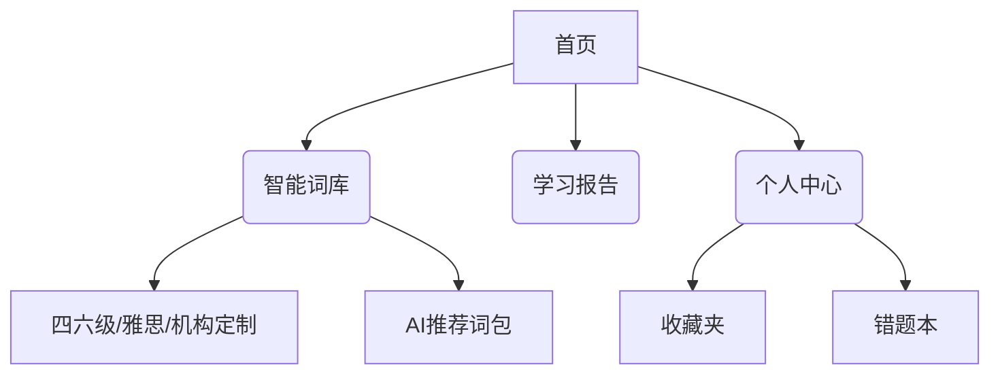

# 词小伴

## 一、项目需求

来源于一个朋友的英语辅导机构，希望为机构学生开发一款英语单词学习软件“词小伴”，主要功能包括：
- 核心记单词功能
- 内置可选词库
- 简洁的页面设计
- 单词本功能
- 收藏单词功能
- 个人中心

## 二、项目思考

英语在生活、工作中应用广泛，结合当前AI技术的发展，可以在传统背单词功能基础上增加AI元素，提升产品竞争力：
- 利用AI技术增强学习体验
- 提供智能推荐和个性化学习路径
- 结合语音识别和生成技术

## 三、需求细化

### 1. 核心用户分层

| 用户类型 | 需求特征 | 对应功能 |
|---------|---------|---------|
| K12学生 | 趣味性+任务驱动 | 游戏化闯关+成就系统 |
| 成人学员 | 效率导向+场景应用 | 行业词库+情景对话练习 |
| 备考群体 | 考点覆盖+记忆科学 | 真题例句+遗忘曲线复习 |

### 2. 核心功能模块设计

#### 2.1 基础功能架构

#### 2.2 创新交互设计

- **极简模式**：单页集成学习流（显示单词→选择认知度→AI生成例句）
- **手势操作**：左滑遗忘/右滑掌握，上滑查看词根分解
- **黑暗模式**：护眼夜间学习方案

参考链接：
- [相关设计参考1](https://media.iflow.cn/common/20251004/1NI4T)
- [相关设计参考2](https://news.qq.com/rain/a/20250521A0881A00)

### 3. AI增强功能实现方案

#### 3.1 智能记忆系统

- 动态间隔算法：融合SM-2与用户行为数据（如错题重复率）
- 多模态助记：自动生成「词根漫画」+「谐音梗记忆图」

#### 3.2 发音纠错引擎

技术实现路径：
1. 语音采集
2. 音素分析(FFT变换)
3. 对比标准发音库
4. 生成三维频谱对比图
5. 突出显示偏差音素

#### 3.3 情境化学习

- AI情景生成器：输入"商务会议"，自动生成对话模板
- 虚拟角色陪练：支持选择英音/美音AI tutor

### 4. 定制化功能

- **个性化学习路径**：通过AI技术帮助用户进行水平测试，量身定制学习计划，根据个人目标和学习进展动态调整
- **多样化学习内容**：针对不同行业和职位需求，提供定制化课程和实用场景演练，如行业英语
- **智能化教学**：结合AI技术实现实时纠错、智能写作批改、AI口语陪练等功能，提升学习体验
- **互动型学习**：提供VR场景模拟、AI智能陪练等沉浸式学习体验，提高学员参与感和学习兴趣

### 5. 界面设计原则

1. **界面简洁化**
   - 确保界面设计简单明了，便于用户快速找到所需功能
   - 根据用户需求进行模块化设计，避免界面拥挤
   - 使用清晰、易懂的图标和色彩搭配，增强视觉体验

2. **符合用户需求**
   - 充分分析用户行为和需求，关注用户体验流畅性
   - 减少操作复杂度，降低学习成本
   - 为不同用户提供个性化学习体验，如定制学习路径和资源推荐

3. **增强互动性**
   - 增加互动功能，如问答、游戏化体验等
   - 提高用户参与度和学习兴趣

4. **提供反馈机制**
   - 建立完善的反馈机制，收集用户意见
   - 及时改进产品，维持用户长期使用

## 四、开发建议

建议优先开发MVP版本，聚焦以下核心卖点：
- 智能词库
- AI发音评测

**注意事项**：
- 需特别关注教育类小程序的内容审核标准
- 建议提前准备资质材料
- 机构定制功能可考虑分阶段迭代，首版先实现基础词库管理

## 五、参考资料

1. [trae 深度体验：使用trae完美开发微信小程序](https://zhuanlan.zhihu.com/p/22853766393)
2. [WordCard 我的卡 - 微信小程序](https://mergeek.com/latest/NXeQPnJzx9gn1d8J)
3. [AI 开发题库测评小程序](https://my.feishu.cn/wiki/Fw6SwfI1wio1MIkRdc4chJcNnVd)
4. [5 个维度、6 个 App，帮你选出最适合自己的「背单词神器」](https://sspai.com/post/87587)
5. [GitHub - Mint-green/UnlearnableWord: 一个背单词小程序](https://github.com/Mint-green/UnlearnableWord)

