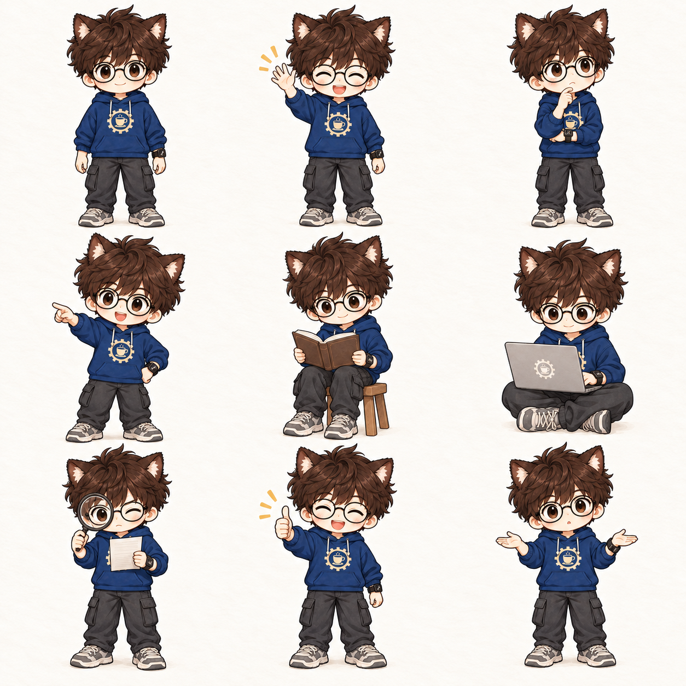

# 小天视觉内容 Skill

**v0.3.3** · 一个技能，包含知识全景图、网站文章配图、小红书图文和动画视频四个能力，共用小天 Agent 形象与温暖手绘品牌风格。

## 四个能力

| 能力目录 | 用途 | 交付 |
|---|---|---|
| [knowledge-map](knowledge-map/GUIDE.md) | 整理内容和知识结构 | 一张知识全景图，约定范围内主干完整 |
| [article](article/GUIDE.md) | 网站深入解释，以文字为主 | 少量场景插画或机制图 + 按需复习总览 |
| [xiaohongshu](xiaohongshu/GUIDE.md) | 用章节图建立认识 | 简洁封面 + 3:4 章节图文 |
| [video](video/GUIDE.md) | 将内容制作成动画讲解 | 实际可播放的动画视频 |

输入可以相同，输出目标不同。图形结构按内容选择，人物身份和品牌风格保持一致。

网站保留深入解释，小红书用章节图建立认识，全景图用于复习。网站默认不按每章放大图；明确要求章节图时覆盖主要小节。小测试、参考答案和参考资料默认不配图，已有合格图复用。

文章配图先提炼读者需要理解的关键判断，再决定画动作场景还是精确机制图。小天参与具体动作，卡片与箭头按需使用，避免把正文做成文字密集的课件。方法见 [文章场景设计](article/visual-storytelling.md)。

## 下载与使用

下载完整 `xiaotian-visual/` 目录，保留所有内部文件。可让 Agent 直接读取其中的 `SKILL.md`，或将目录放入宿主支持的技能位置加载。无需另装人物技能，也不依赖原作者电脑和聊天记录。

宿主识别技能后使用同一个名称：

```text
使用 $xiaotian-visual，将这份学习笔记整理成一张知识全景图。
```

```text
使用 $xiaotian-visual，为这篇网站文章选择少量场景插画或机制解释图，必要时在文末放一张复习总览。
```

```text
使用 $xiaotian-visual，生成约 8 秒的小天动画：抬手指向右侧卡片，目光跟随，无旁白。
```

如需先审核，在请求末尾加“先分析并给出方案，不生成图片或视频”。单独制作立绘、表情和姿态也可直接提出需求。

```text
使用 $xiaotian-visual，为文章第 1–5 个大章节配图，覆盖各章主要小节。
已有合格图片直接复用，小测试、参考答案和参考资料不配图，并将图片插入对应大标题后。
```

```text
使用 $xiaotian-visual，保留现有横版全景图，另做一张 3:4 竖版用于分享。
主要模块与关系保持完整，重新排版，不能裁掉内容或让人物遮字。
```

## 小红书图文

```text
使用 $xiaotian-visual 的 xiaotian-xiaohongshu 能力，把这篇文章做成小红书图文。
封面加必要的章节卡，3:4 竖版；复用已有合格图片，横图重新排版。
全景图另留作复习，不重复塞入组图。只制作本地素材，不发布。
```

`xiaotian-xiaohongshu` 是包内能力别名，不是需要单独安装的第二个技能。页数按内容确定，不固定六页。可交付顺序编号的图片和最终图片 ZIP；标题、正文、话题按需制作。

## 文件结构

```text
xiaotian-visual/
├── README.md
├── SKILL.md                         # 唯一技能入口，选择能力
├── agents/openai.yaml               # 唯一界面配置
├── knowledge-map/GUIDE.md           # 单张知识图流程
├── article/
│   ├── GUIDE.md                     # 正文选图与插入流程
│   └── visual-storytelling.md       # 场景设计、提示词与验收
├── xiaohongshu/GUIDE.md             # 小红书封面与章节卡
├── video/GUIDE.md                   # 动画制作流程
├── references/
│   ├── character.md                 # 唯一角色规范
│   ├── character-workflow.md        # 共用人物制作流程
│   └── prompts-and-qa.md            # 人物提示词与验收
└── assets/
    ├── character-style-reference.png  # 已认可的九宫格动作参考
    ├── character-front-reference.png  # 正面全身细节参考
    └── article-style-reference.png    # 文章布局与配色参考
```

能力目录是内部工作指南，不是需要单独安装的技能。用户读本页，Agent 从 `SKILL.md` 进入，按任务读取对应指南。

## 默认视觉与工具条件



九宫格为已认可的默认人物与动作参考，保持温暖手绘二次元风格。[正面立绘](assets/character-front-reference.png) 用于核对细节，[文章整图示例](assets/article-style-reference.png) 仅用于配色与排版。九宫格不是多视角角色表或动画连续帧，具体使用方式见 [角色规范](references/character.md)。

本技能提供指令和参考，不自带生成引擎、账户或额度。图片需要图像工具或绘图渲染能力；动画需要视频生成或真实人物动画渲染能力。仅有文字工具时可做方案，不能完成图片或动画。

动画需有实际人物动作，静态图片的平移缩放不等于人物动画。额外付费和外部素材上传按具体任务授权。输出保存在当前工作区，检查后交付；技能结构校验不代表生成效果已经通过实测。

视频按内容选择 A-roll 讲解、机制演示、知识卡片、模拟输入或真实录屏，共用品牌基调。包含镜头提示词、头颈肩动态检查、实际配音时间轴与字幕验收，见 [视频指南](video/GUIDE.md)。人物形象采用已认可九宫格，头颈肩与服饰规范共用角色规范 v0.2。

## 从旧结构迁移

本目录替代此前四个独立的小天技能目录，统一调用名为 `$xiaotian-visual`。更新安装时停用旧入口，避免同时触发旧规则；用户自己的角色母版与作品应保留在工作区，不随技能更新覆盖。
